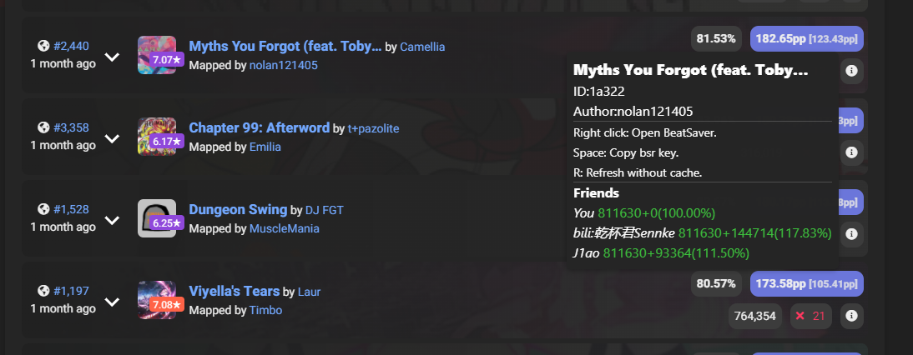

# 更好的ScoreSaber网站
- English version `README.md` is coming soon.
## 功能简介
- 显示key 跳转至beatsaver网站 复制bsr key
- 将你的分数与你设置的玩家进行对比
- ……
## 安装教程
### Ⅰ 安装油猴
要使用用户脚本，您首先需要安装一个用户脚本管理器。您可以根据当前使用的浏览器来选择一个用户脚本管理器：

**Chrome**: [Tampermonkey（需科学）](https://chrome.google.com/webstore/detail/tampermonkey/dhdgffkkebhmkfjojejmpbldmpobfkfo) 或 Violentmonkey

**Firefox**: Greasemonkey、[Tampermonkey（推荐）](https://addons.mozilla.org/firefox/addon/tampermonkey/)
或 Violentmonkey

**Safari**: [Tampermonkey（推荐）](http://tampermonkey.net/?browser=safari) 或 Userscripts

**Microsoft Edge**: [Tampermonkey（推荐）](https://www.microsoft.com/store/p/tampermonkey/9nblggh5162s)

**Opera**: [Tampermonkey（推荐）](https://addons.opera.com/extensions/details/tampermonkey-beta/)
或 Violentmonkey

**Maxthon**: [Violentmonkey](http://extension.maxthon.com/detail/index.php?view_id=1680)

**Dolphin**: [Tampermonkey](https://play.google.com/store/apps/details?id=net.tampermonkey.dolphin)

### Ⅱ 安装脚本
安装Tampermonkey后，[点击我下载&安装BetterScoreSaber](https://cdn.jsdelivr.net/gh/MicroCBer/BetterScoreSaber/BetterScoreSaber.user.js)

## 截图

